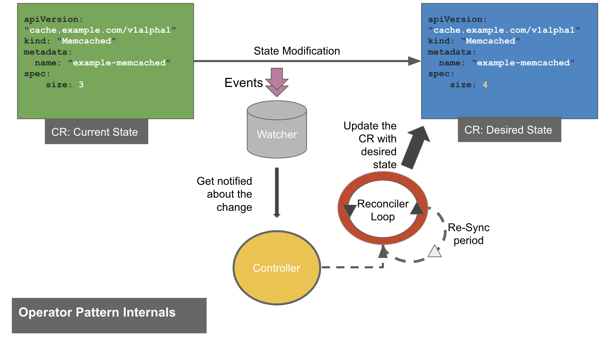

# What is an Operator?

Operators are software extensions to Kubernetes that make use of custom resources to manage applications and their components. [Kubernetes documents](https://kubernetes.io/docs/concepts/extend-kubernetes/operator/)

In the real world, we can define Operators: as a person who operates on some task(machine, equipment, process). Let's say it works on a given task "X". What qualities are required to peform the task X?

We can classify an operator qualities into three categories:

* Observe
* Analyze
* Act

Observe the X work, analyze the state of X and finally act based on the current state of X to reach the desired state. Which will make the operators task completed, once we attain the desired state.

Similar work/tasks are performed by an operators. It helps us to extend the Kubernetes API to allow custom functionality or behavior based on the needs of the consumer.

# Operator Pattern 

* Observe: __Events__
* Analyze: __Current Vs Desired State__
* Act: __Reconciler Loop__

## Components: 

* Controller: Register the Custom Resource Definition and adds it to the Kubernetes API Schema, exposes a new API end-point for the CRD, added watchers for the namespace to observe, runs a process/loop i.e control loop for acting based on the desired change.

* Watchers: Allows to observe the events for speific resources type.

* Reconciler: Any modification to the CR is handled by the reconcilation loop. Requeue after conflict/error with an interval defined by the re-sync period. 

## Classification based on deployement type
* Namespace scoped
* Cluster scoped

## Example Operator Workflow

* Defines a namespace(namepace-scoped) for our controller
* Creates the CRD: ToDo.
* The controller analyzes the CRD and adds it to the Kubernetes API Schema, exposes a new API end-point for the CRD, added watchers for kind CRD type.
* Now our controller is in the running state. It watches the namespace for any changes.
* Creating an instance of the CRD, by creating a Custome Resource object (CR)
* When a CR object is created. it triggers an event which gives control to the Reconciler loop.
* Reconcile reads that state of the cluster for a Custom object and makes changes based on the desired state.
* In this case, it will create a Pod for the desired ToDo resource or any custom logic we intend for this operator
